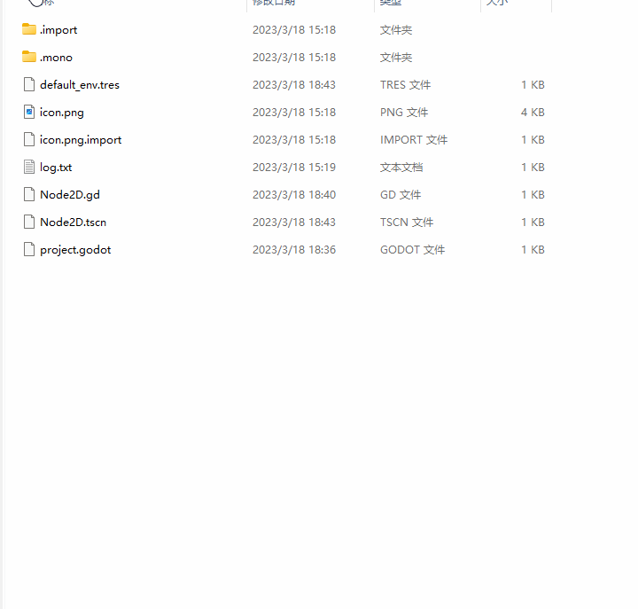
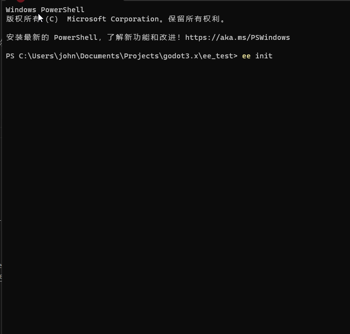
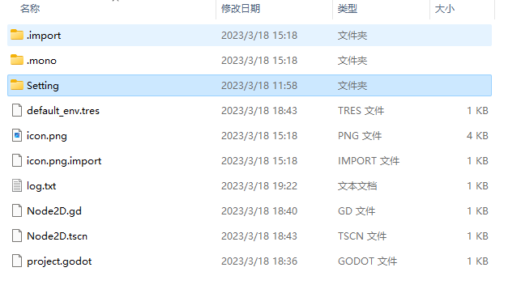
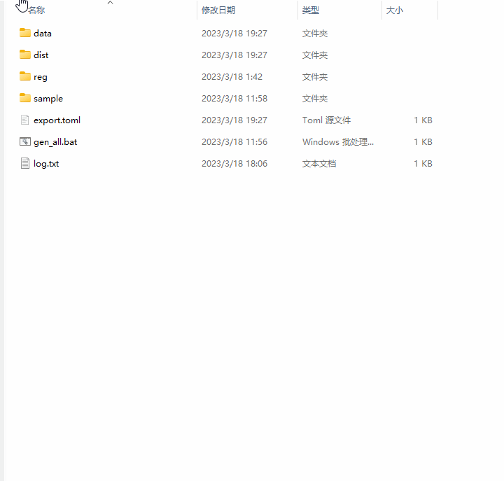
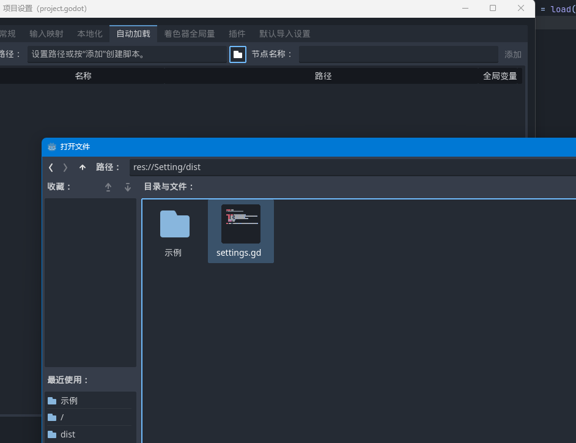
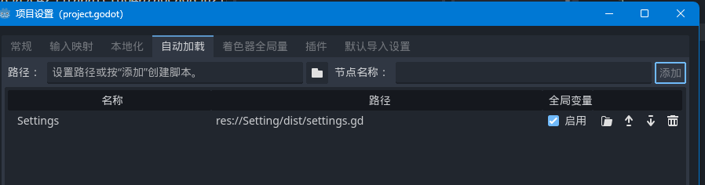

# GDExcelExporter

> **Note**
> Translated by chat-gpt3.5

GDExcelExporter is a tool for exporting data resources from Excel spreadsheets designed for Godot.
It comes with several export and read schemes (exporters), supporting both Godot 3.x and 4.x.

Here, `ee` refers to `GDExcelExporter`.

[Online documentation](https://kaluluosi.github.io/GDExcelExporter/)

## Changelog

Version 2.1

> **Warning**
> Starting from version 2.0, the export format is no longer compatible with 1.0. If your project has already used a large number of data tables exported in version 1.0, you may need to modify your code significantly.

1. Refactored the exporter
2. Support for exporter plugins through `entry_points`, allowing the development of custom exporter plugins
3. Multi-language support, integrated with the `pybabel` multi-language solution, and directly supporting the extraction of multi-language text in configuration tables, gd scripts, tscn, and tres files of the entire Godot project. A separate document will be provided in the future to explain this feature.
4. Additional unit test cases
5. ~~Unfortunately, due to pyinstaller not supporting `entry_points`, a standalone `exe` is no longer provided starting from version 2.1.~~ `ee.exe` is available again from version 2.1.4.

## Why Do We Need This Tool?

In the Unreal Engine, there is a tool called DataTable, which acts as a small database for game designers to edit configuration numerical data.

To give an example, if there is a property system in a game, once the object property field is modeled, various properties can be defined based on these properties by configuring them. 

Before using DataTable, we either had to write a dictionary in script code or a JSON file, which was difficult to maintain. The database (even sqlite) is too heavyweight, and it is not conducive to editing and testing. Moreover, the database's loading interface is also cumbersome and not very direct.

Therefore, the Unreal Engine's solution was to develop a lightweight file database called DataTable within the engine, where we can fill a large number of data entries in various DataTables, and then programmers can directly access and read the data in these DataTables.

However, Chinese game developers are more inclined to compromise. Because our Office Excel spreadsheet tool is basically a lightweight file database and has been developed as a productivity tool for so many years, it has powerful data processing capabilities, support for Vbscript extensions, and is very suitable for acting as a data management tool.

Therefore, the use of Excel spreadsheets as DataTable has become a popular practice.

GDExcelExporter is just a porter. It converts the table data designed according to its specification into a data file that the game engine can directly read.

With this tool:
1. You don’t need to write JSON by hand.
2. You don’t need to embed sqlite.
3. As the data exists as a project file resource, it is version control tool-friendly.
4. As data is a file resource, it is friendly towards hot updates.
5. You don't need to learn other tools to edit and maintain data, you can use Excel, and use all the Excel tricks to edit data.

## Quick Start

### System Requirements
Python:^3.8.1

Platform: Windows (xlwings only supports Windows)

Godot version: ^3.4

### Installation
Use pip (recommended)
```
pip install gd_excelexporter
```

Or download the pre-packaged executable file (`ee.exe`) from the release on the right and add the exe to the environment variable.

> **Note**
> The packaging problem of exe has been solved since version 2.1.4. Later versions will continue to provide the command-line program `ee.exe`.

### Creating a Configuration Project

Open your Godot game project, right-click the root directory, and select "Open PowerShell window here" (or equivalent).

  
  
  
  

* data—store your Excel files
* dist—where the exported data files are stored
* reg—the reg scripts inside add the context menu to facilitate exporting
* sample—contains example Excel spreadsheets
* export.toml—export configuration, defining how `ee` should export
* gen_all.bat—contains one line of code `ee gen-all`, mainly for quick exporting of all spreadsheets without needing to open the command line
* gen_pot.bat—will be supplemented later for extracting multi-language text of the entire project.

### Configuring and Exporting Your First Data File

  

### Reading in Your Game

First, add `Setting\dist\settings.gd` to your project's autoload.

  
  

Then, you can read the data, as below.

  
  

## Table Specifications

Due to limited space, I am unable to explain all the details. Therefore, I have left a `sample` directory with an `example.xlsx` template for you to reference when creating a new spreadsheet.
All tables exported by `ee` must conform to its strict format requirements.

### Export Path

`ee` treats the Excel file as a folder, with sheets as data tables. Therefore, the export path is `example\demo.gd`.

### Ignoring Symbols

`ee` ignores sheet names beginning with `~` and field names beginning with `*`.
This allows you to leave comments in the tables.

## Features

GDExcelExporter supports exporting Excel spreadsheets into several different data file formats, each of which has differences in features, performance, and usage. 
Quick start only demonstrates the use of the GDS2.0 exporter and the resulting data file.
You need to explore other exporters by yourself.

### Exporter Types

| Exporter ID | Exporter Name   | Godot 3.x     | Godot 4.x     | C#            | Supports Code Configuration |
| ----------- | --------------- | ------------- | ------------- | ------------- | --------------------------- |
| GDS1.0      | GodotScript 1.0 | ✔             | ❌             | ❌             | Supported                   |
| GDS2.0      | GodotScript 2.0 | ❌             | ✔             | ❌             | Supported                   |
| RESOURCE    | Resource        | ✔             | ✔             | ✔             | Not supported               |
| JSON1.0     | Json            | ✔             | ✔             | ✔             | Not supported               |
| JSON2.0     | Json            | ✔             | ✔             | ✔             | Not supported               |
| C#          | CSharp          | Not developed | Not developed | Not developed | Not developed               |

The following introduces the differences between the exporters.

#### GDS1.0 and GDS2.0

These two exporters export an Excel spreadsheet as a GodotScript class, which has a `data` dictionary variable that is filled with the data from the table.

```go
# GDS1.0
extends Reference
var None = null
var False = false
var True = true

var data = \
{1: {'array': [1, 2, 3, 4, 5], 'array_bool': [True, False], 'function': funcref(self,'function_1')...


static func function_1(args=[]):
    print(args)
```
```go
# GDS2.0
extends RefCounted
var None = null
var False = false
var True = true

var data = \
{1: {'array': [1, 2, 3, 4, 5], 'array_bool': [True, False], 'function': Callable(self,'function_1')...


static func function_1(args=[]):
    print(args)
```

Advantages of using GodotScript as a data source:
1. In addition to being source code, GodotScript is also a game resource, so writing data directly to a script as a data source eliminates the need to read and parse files.
2. As it is a GodotScript, syntax errors are detected by the editor, and data errors can also be accurately detected during runtime.
3. GodotScript loading is significantly faster than using `FileAccess`.
4. It is a script, so you can configure code in the Excel spreadsheet.

The difference between the GDS1.0 and GDS2.0 exporters is not significant. It's just that the `Reference` class and `Funcref` class have been renamed to `RefCounted` and `Callable` in GodotScript 2.0, so separate exporters were created for each.

#### RESOURCE

This exporter uses Godot Resource files as a data source.

```
[gd_resource type="Resource" script_class="EEDataTable" load_steps=2 format=3]

[ext_resource type="Script" path="res://Setting/dist/ee_data_table.gd" id="1"]

[resource]
script = ExtResource("1")
data = {1: {"array": [1, 2, 3, 4, 5], "array_bool": [true, false], ...
```

Compared to the GDS solution, it doesn't offer any significant advantages. It does not support code configuration, and its reading efficiency is slower.

#### JSON1.0 and JSON2.0

This exporter uses JSON text files as a data source. Compared to other solutions, the other formats are one-stop Godot, reading and resolution are all handled by Godot, while JSON files need to have a method of reading and resolution written in the `settings.gd`.

Json has no real advantage, except that json files are human-friendly and easier to read than other formats, which are all in one unreadable line.

```json
{
  "1": {
    "id": 1,
    "int": 1,
    "float ": 1.0,
    "string": "恭喜你！成功配置好了Godot导表项目。",
    "bool": true,
    "array": [
      1,
      2,
      3,
      4,
      5
    ],
    "array_str": [
      "a",
      "b",
      "c"
    ],
    "array_bool": [
      true,
      false
    ],
    "dict": {
      "name": "Tom",
      "age": 10
    },
    "function": "print(args)"
  },...
```

As Godot's file I/O interface changes in Godot 4.0, two JSON exporters are provided to correspond to Godot 3.x and Godot 4.x, respectively.

## Conclusion

I hope this tool will help some independent game developers or amateur enthusiasts. If you use my tool and encounter any issues, it's best to open an issue.

