# GDExcelExporter

这个excel表导出工具是为godot项目而开发，当然设计的比较灵活可以定制导出过程用于加工生成任何你想要的数据格式文件（你得自己写python代码去定制）

## 使用方法

目前这个导出工具没有独立exe，依赖python 3.8

pip上安装

```
pip install gd-excelexporter
```

或者直接git clone 这个项目、下载这个项目，在项目目录下执行

```
pip install .
```

在控制台里输入`ee`命令即可看到命令

```shell
sage: ee [OPTIONS] COMMAND [ARGS]...

  ==========Excel表导出工具 ============

Options:
  --help  Show this message and exit.

Commands:
  create-completed-hook  创建导表完成钩子脚本
  create-generator       创建生成器脚本
  gen-all                导出所有表
  gen-one                打开并导出整张excel表
  init                   生成默认配置表项目
```


## 快速开始
Godot项目使用很简单

直接到你的游戏项目里创建一个`Settings`目录，然后进入该目录执行以下命令。
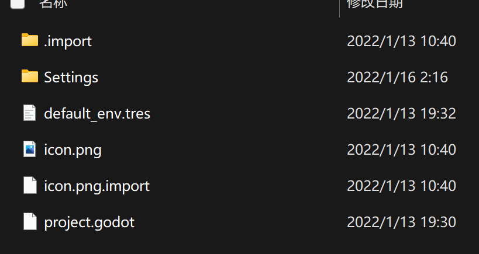

```shell
ee init
```

然后就会生成下面文件
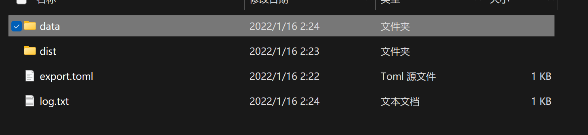

把你的Excel表放到data目录。
注意！Excel表有格式要求，你可以直接复制test目录下的范本过去。

然后在这个目录下调用：

```shell
ee gen-all
```

dist目录下就会生成以下文件
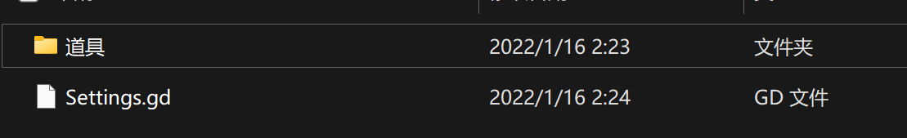
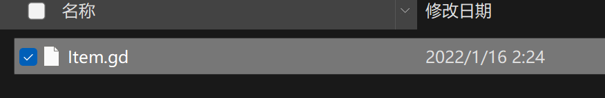

```python
extends Reference

static func data():
    var None = null

    data = \
    { 1.0: { 'desc': None,
         'id': 1.0,
         'name': '金币',
         'overlap': -1.0,
         'sell_price': None,
         'type': '虚拟道具',
         'use_effect': False},
  10001.0: { 'desc': '飞蝗石，可以扔向敌人',
             'id': 10001.0,
             'name': '石头',
             'overlap': 100.0,
             'sell_price': 1.0,
             'type': '消耗品',
             'use_effect': 2.0}}
    return data
```

```python
extends Node

var Item = load(f'res://Settings/dist/道具/Item.gd')

```

然后把Settings.gd挂到Autoload里面去。


这样你就可以快乐的在GDScript代码里这样读表了：
```python
func _ready():
    var item_data = Settings.Item.data()
    var item = item_data[10001]
    var item = item.name # => 石头
```


## exporter.toml讲解
```toml
[settings]
ignore_sheet_mark = "*"  # 如果sheet以这个符号开头，那么就跳过不导出
custom_generator = "" # 自定义生成脚本（用python写）
completed_hook = "" # 自定义导出结束钩子脚本 （用python写）
input = "data" # 你Excel表所在目录的相对路径
output = "dist" # 你要输出保存的相对路径
project_root = ".." # 项目文件夹相对于当前Settings目录的路径
```

**ignore_sheet_mark**

如果sheet以这个符号开头，那么就跳过不导出

**custom_generator**

自定义生成脚本路径（用python写），是用来覆盖默认生成逻辑的。
GDExcelExporter默认生成的是GDScript数据文件，如果你有自己的数据文件方案，比如生成json、Resource、乃至C#，又或者其他，你得自己实现。本项目Sample文件夹下有示例。

**completed_hook** 

自定义导出结束钩子脚本路径（用python写），用来覆盖导完表后的处理。
GDExcelExporter默认会在这里处理生成一个Settings.gd文件，用来快速读表。
你有自己的需要可以自己实现一个脚本然后路径设置上去覆盖。

**input** 

你Excel表所在目录的相对路径

**output** 

你要输出保存的相对路径

**project_root**

这个比较难理解，简单的说就是你的`Godot游戏项目`对于`Settings目录`的相对路径。
比如你的`Settings目录`是在`Godot游戏项目目录`下，那么相对路径就是"../"，`Settings目录`的上一级就是`Godot游戏项目目录`。这样`Settings.gd`生成代码里load数据文件的资源url才能正确生成，不然你可能得到的是 “res://dist/道具/Item.gd”，这就不正确了。

举个例子，你可能想要这样的效果：`Settings目录`跟`Godot游戏项目`平级，然后把数据文件导出到`Godot游戏项目`。你的目录结构是这样的：

```
--+
  |--- Godot游戏项目
  |           |
  |           +----Data
  |----Settings
```
你想从`Settings目录`把数据文件导入到`Godot游戏项目/Data`目录里

那么你的export.toml要这样配置

```toml
[settings]
ignore_sheet_mark = "*"  
custom_generator = "" 
completed_hook = "" 
input = "data" # 
output = "../Godot游戏项目/Data" 
project_root = "../Godot游戏项目" # 项目文件夹相对于当前Settings目录的路径
```

这样子 GDExcelExporter 就能够知道 `../Godot游戏项目` 才是项目根目录，从而生成“res://”路径的时候才能正确截取相对于项目目录的路径塞进去。

## Excel表格式

**sheet格式**

**注意！Excel表格式有固定要求！**
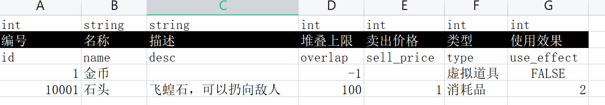

|int|float|string|
|---|---|---|
|编号|名称|售价|
|id|name|price|
|数值|数值|数值|

上面是示例

GDExcelExporter会固定读取头三行数据，第四行开始才算是表具体数据，头三行只是定义描述，GDExcelExporter本身不会去根据这些类型作什么处理，会被存到data字典传递给custom_generator脚本供具体使用。

1. 第一行是用来定义字段类型
2. 第二行是字段中文描述
3. 第三行是字段英文名（用于生成字典的key）

除了头三行必须要有数据外，什么颜色，格式之类的没有要求，你可以随意标注颜色加批注不影响。

**Sheet名字规则**


中文名[-生成文件名]

生成文件名是可选的，如果你希望生成的数据文件是别的名字（主要是生成英文文件名），那么你加上，不然Exporter默认传递给custom_generator的output是用中文名。


字段类型请看(字段类型支持)https://github.com/kaluluosi/GDExcelExporter/pull/3]


## 进阶学习（你只是用在godot项目上，那么你不用看这个）

以godot项目为例

先创建配置表目录，你图省事直接放在项目
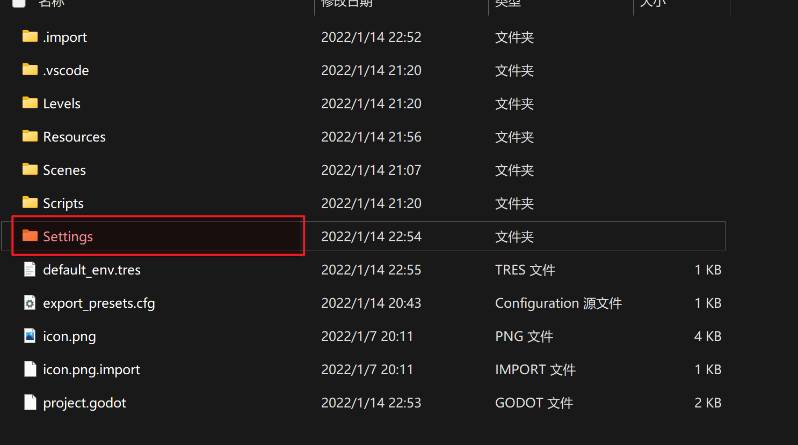

然后进入配置表目录，在目录下打开命令行
```shell
x:\<你的项目路径>\Settings
```

调用`ee init` 创建`exporter.toml`配置文件
```shell
ee init
```
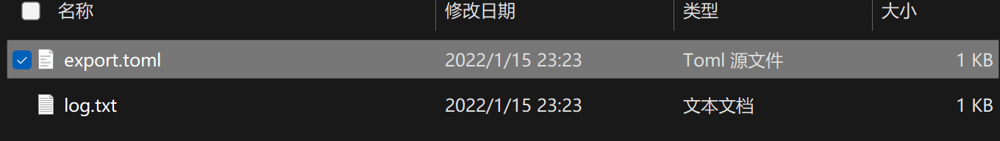

打开`export.toml`

```toml
[settings]
ignore_sheet_mark = "*"  # 如果sheet以这个符号开头，那么就跳过不导出
custom_generator = "" # 自定义生成脚本（用python写）
completed_hook = "" # 自定义导出结束钩子脚本 （用python写）
input = "data" # 你Excel表所在目录的相对路径
output = "dist" # 你要输出保存的相对路径
project_root = "." # 导出到项目的路径，比如你的 output="../Godot项目/Scripts/Settings"，那么project_root="../Godot项目"
```

上图中的意思就是 把Settings/data目录下的所有excel表用custom_generator处理后导出保存到Settings/dist目录。

你可以自己修改input和output的路径，这个路径也支持相对路径。

举个例子如果你的Settings目录是跟你godot项目同级（不在godot项目里，而是在上一层。

```
-+
 |
 ----Godot游戏项目
 ----Settings
```
Settings目录下导出的文件想要保存到`Godot游戏项目/Settings`下，你需要这么配置


```toml
[settings]
...
output = "../Godot游戏项目/Settings" # 用相对路径"../"往上跳一层
```

设置完toml文件后，创建你的input和ouput目录。

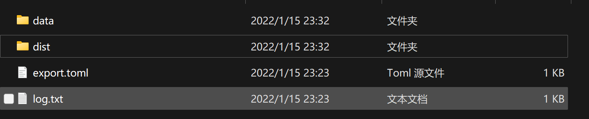

data目录下你可以放你的Excel表

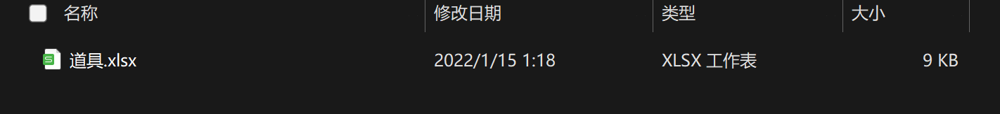


然后我们试一下在这个目录下执行 `ee gen-all`导出这个道具表
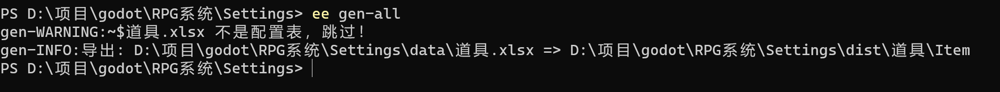
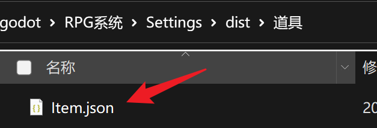

你会发现在dist目录下生成了 `道具\Item.json`
数据文件生成路径是跟input目录结构一致的，同时因为一个Excel文件可以有很多张Sheet，所以会以`Excel文件名\<sheet生成名>.<扩展名>`的格式生成。

为什么生成的是json？因为GDExcelExporter默认的generator直接把GDExcelExporter传过来的data字典对象直接用`json.dump`的方式给转成了json的缘故。

我们打开这个josn
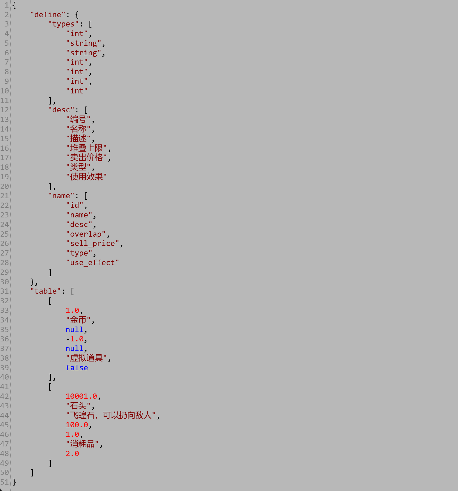

你会发现这个json其实不适合我们在项目中使用：
table下就是每一行数据的数组，如果我们要直接获取 id=10001 的道具数据，那么我们得遍历。没办法直接获取，这很消耗性能，而且每次要加载这个表我们还得用一次File对象读取这个json文件。

如果我们可以直接像这样读取这个数据文件多好：
```python

func _ready():
    var data = preload("res://Settings/dist/道具.json").data

    var 石头数据 = data[10001]
    var 道具名称 = data.name
```

为了实现上面的效果，你需要把data处理成下面的结构：
```json
{ 
   1.0: { "desc": "null",
         "id": 1.0,
         "name": "金币",
         "overlap": -1.0,
         "sell_price": "null",
         "type": "虚拟道具",
         "use_effect": "null"},
  10001.0: { "desc": "飞蝗石，可以扔向敌人",
             "id": 10001.0,
             "name": "石头",
             "overlap": 100.0,
             "sell_price": 1.0,
             "type": "消耗品",
             "use_effect": 2.0}
}
```
以`id`为key，然后把每一行数据以字段名为key，值为value组织成字典。

**要实现上面的效果，我们需要编写自己的custom_generator。**

首先Godot的数据表方案我自己想到两种：

1. 定义一个`Data.gd`，继承Resource类，把Excel数据加工成gd字典生成Resource文件 `.tres`
2. 直接把Excel数据加工生成gd字典，然后生成一个GDScript，这个脚本里面只有一个`static func data()`静态方法，在这个静态方法里返回你的数据

这两个方案在本项目`Sample\Godot`下面都有示例实现

## 实现基于GDScript的数据文件导出

首先在Settings目录下创建CustomGenerator目录用来存放我们自己写的generator.py文件

你也可以直接放到Settings目录下，这个随意，只要exporter.toml配置文件里你配置的路径找得到这个文件就可以。我推荐放到一个目录下是因为你以后有需求可以把这个generator.py写的更加复杂，比如在那个目录下再写一些别的脚本供generator.py引用调用。其中一个用法就是扩展导表检查，或者对某个表做定制加工处理，组织成别的数据结构。
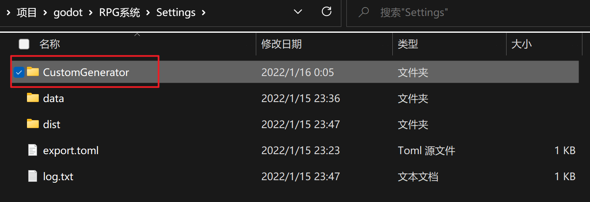

进入CustomGenerator目录，调用以下命令

```shell
ee create-generator
```

你会看到生成了一个custom_generator.py脚本文件
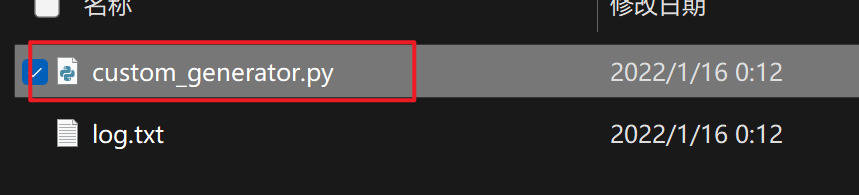

```python
# 传入到此脚本的变量
# data : 读取sheet表加工成的字典
# {
#   "define":{
#       "types": ['int'...],  -- 读取的表中第一行类型定义
#           "desc": ['描述'...], -- 读取的第二行字段描述
#           "name": ['id'...] --读取的第三行字段名
#   },
#   "table":[...] -- 每一行数据的值
# }
# data只是把表转成字典，你要怎么加工这个字典生成你想要数据格式并生成文件需要
# 你自己在这个脚本里实现
# 
# output: 导出文件。 
# 这个路径只有文件名，没有扩展名，例子： D://dist/道具/item
# 如果你需要有扩展名，自己加 output+=".gd"，然后自己写入文件。

# CFG 就是export.toml配置字典，你在哪个目录下执行ee命令，那么CFG就读哪个目录的export.toml
# CFG["settings"]["input"] -- 读取配置表目录路径

# 内置jinja包，你可以：
# import jinja 
# 然后使用jinja模板来生成你的文件

# 下面是示例，直接导出保存成json文件，你可以删掉下面代码用jinja模板工具
# 用模板生成你的代码文件，然后写入output路径保存成代码文件

def gen(data, output):
    # 在这里面写你的加工逻辑
    import json
    with open(output+".json",'w+', encoding='utf-8') as f:
        json.dump(data, f, ensure_ascii=False, indent=4)

gen(data,output)
```

这个脚本文件很简单，上面的注释已经讲解了data和output是什么结构。
而gen函数就是把GDExcelExporter传递过来的data直接用json模块dump到output里面而已。而GDExcelExporter默认的生成器跟这个一样。

我们现在试着改这个脚本，改成这样：

```python

def gen(data, output):
    # 在这里面写你的加工逻辑
    import json
    with open(output+".json",'w+', encoding='utf-8') as f:
        f.write("hello world")

gen(data,output)

```
这样无论导什么表生成的内容都是`hello world`

然后我们修改Settings目录下的`exporter.toml`

```toml
[settings]
ignore_sheet_mark = "*"
custom_generator = "CustomGenerator/custom_generator.py"
completed_hook = ""
input = "data"
output = "dist"

```

然后再Settings目录下调用`ee gen-all`

重新打开 Item.json你会发现
```json
hello world
```

这下你大概明白了，custom_generator就是用来覆盖默认导出逻辑，你需要做的就是去加工GDExcelExporter传递过来的data，把它加工成你想要的数据结构然后序列化成目标数据文件的格式。

那么我们要实现把Excel表数据导出成GDScript下一步怎么做？

首先GDScript本身也是一种资源，可以被load和preload的。其次GDScript支持静态函数，但是不支持静态变量。

所以我的实现思路是，在generator里生成下面的GDScript：

```python
extends Reference

static func data():
    var None = null

    data = \
    {   1.0: { 'desc': None,
         'id': 1.0,
         'name': '金币',
         'overlap': -1.0,
         'sell_price': None,
         'type': '虚拟道具',
         'use_effect': False},
        10001.0: { 'desc': '飞蝗石，可以扔向敌人',
             'id': 10001.0,
             'name': '石头',
             'overlap': 100.0,
             'sell_price': 1.0,
             'type': '消耗品',
             'use_effect': 2.0}
    }
    return data
```

那么你就可以在其他GDScript里面这样读这张表了：

```python
func _ready():
    var item_data = load("res://Settings/dist/道具/Item.gd").data()
    var item = item_data[10001]
    var item = item.name # => 石头
```
用GDScript作数据文件的好处：
1. 由于Item.gd是继承子Reference，所以是会被load缓存的，并且我们没有实例化这个对象只是调用静态方法获取数据，所以不会有实例对象产生，不会有垃圾回收。
2. 速度快，同一个表读数据1000次只花费 60 ms，另一个用Resource做数据文件的方案是 270 ms

下面就动手写这个逻辑：

```python

def gen(data, output):
    import textwrap # 这个模块帮我们把字符串编辑器里的缩进干掉，对齐文本
    import pprint # 这个模块可以帮我们缩进打印python字典，好看点

    # 表格数据脚本模板
    # 注意你在编辑器里用"""写字符串，左边编辑器的缩进也会算进这个字符串里的
    # 要用textwrap.dedent去掉这个对齐缩进
    template = """
    extends Reference

    static func data():
        var None = null

        data = \\
        {data}
        return data
    """
    template = textwrap.dedent(template) # 把编辑器里的对齐缩进干掉

    # 在这里面写你的加工逻辑
    field_names = data["define"]["name"] # 获取字段名数组
    table = {}
    for row in data["table"]: # 循环遍历table键下的每行数据数组
        row_data = {}
        for index,value in enumerate(row):
            field_name = field_names[index]
            row_data[field_name] = value
        table[row_data['id']] = row_data # 我们定死表里一定有id字段
    
    # 用format函数格式化字符串，把{data}替换掉
    code = template.format(
        data=pprint.pformat(table,indent=2) # 用pprint来获取python风格的字典字符串，相当于用python风格序列化这个字典
        )
    
    # output只是生成路径，没有扩展名，扩展名你得自己加上
    # 这里我们导出的文件扩展名是'.gd'
    with open(output+".gd", 'w+') as f:
        f.write(code) # 把生成的代码写入

gen(data,output)

```

保存后你在Settings目录下再执行一次`ee gen-all`

你就得到了`Item.gd`文件，下面是文件内容
```python

extends Reference

static func data():
    var None = null

    data = \
    { 1.0: { 'desc': None,
         'id': 1.0,
         'name': '金币',
         'overlap': -1.0,
         'sell_price': None,
         'type': '虚拟道具',
         'use_effect': False},
  10001.0: { 'desc': '飞蝗石，可以扔向敌人',
             'id': 10001.0,
             'name': '石头',
             'overlap': 100.0,
             'sell_price': 1.0,
             'type': '消耗品',
             'use_effect': 2.0}}
    return data

```

都到了这一步了，怎么用这个文件去读取data，应该都不用我教了。

到此你就实现了自己的Godot项目导表。

但是即便如此，每次要读表都要写这么长的代码有点烦：
```python
func _ready():
    var item_data = load("res://Settings/dist/道具/Item.gd").data()
    var item = item_data[10001]
    var item = item.name # => 石头
```

能不能简化成下面：
```python
func _ready():
    var item_data = Settings.Item.data()
    var item = item_data[10001]
    var item = item.name # => 石头
```

这就要用到`completed_hook导表完成钩子`

## completed_hook 导表完成钩子

导表完成钩子主要的用处是在导表结束后做一些处理，而作者我设计这个完成钩子主要是为了生成下面代码到Settings.gd文件里：

```python
class_name Settings
extends Object

const var Item  = preload(f'res://Settings/道具/Item.tres')

```

这样你就可以在GDScript里这样读表了：
```python
func _ready():
    var item_data = Settings.data()
    var item = item_data[10001]
    var item = item.name # => 石头
```

实现方式仁者见人，智者见智。

你可以用`ee create-completed-hook`命令生成示例脚本，不过这个示例脚本里面没有任何代码，因为我也不知道你想要做什么。如果你是想参考，那么你可以去本项目`Sample\Godot`看下我的实现。

如果你是Godot项目，而且想抄我的实现，继续往下看。

我的实现方式如下：
思路是遍历`Settings/dist`目录所有生成的文件

```python

from glob import glob
import os
import textwrap
output_path = CFG['settings']['output']
output_dirname = os.path.basename(output_path)
settings_file_path = os.path.abspath(f'Settings.gd')


lines = []

for path in glob(f'{output_path}/**/*.*', recursive=True):
    basename = os.path.basename(path)
    setting_name = os.path.splitext(basename)[0]
    path = path.replace("\\","/")
    lines.append(f"const var {setting_name} = preload(f'res://{path}')")

# 去掉缩进
code = textwrap.dedent("""
class_name Settings
extends Reference

{refs_code}
""")
refs_code = '\n'.join(lines) 

code = code.format(refs_code=refs_code)

with open(settings_file_path, 'w') as f:
    f.write(code)

```

生成出来的Settings.gd文件

```python
class_name Settings
extends Reference

const var Item = preload(f'res://Settings/道具/Item.gd')
...

```

这样你就可以快乐的在代码里这样读表了：
```python
func _ready():
    var item_data = Settings.Item.data()
    var item = item_data[10001]
    var item = item.name # => 石头
```
