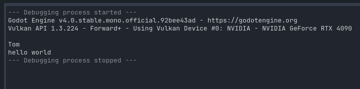

# GDExcelExporter 2.1

GDExcelExpoter 是为Godot设计的Excel表格导出数据资源的工具。
它内置了好几种数据表导出和读取方案（导出器），支持Godot3.x、Godot4.x。

下面我们用`ee`代指`GDExcelExporter`。

## 更新日志

2.1版本

> **Warning** 
> 2.0 开始导出格式已经不兼容1.0，如果你的项目里已经大量使用1.0导出的数据表，可能会导致你要修改代码的地方非常多。

1. 重构导出器
2. 通过`entry_points`支持导出器插件，现在可以开发自己的导出器插件
3. 多语言支持，集成了pybabel多语言方案，直接支持配置表、gd脚本、tscn、tres整个godot项目的多语言文本提取。以后出一个文档单独讲解。
4. 单元测试用例补充
5. 悲报：因为pyinstaller不支持 `entry_points` 因此2.1版本之后不提供独立`exe`了。

## 为什么需要这个工具？

Unreal引擎中有一个工具叫做DataTable，它的作用是充当一个小型的数据库给游戏设计人员编辑配置数值数据。

打个比方，我们游戏中有道具系统，而道具整个对象一旦属性字段建模好，那么就可以通过配置这些属性定义出各种各样的道具。

而这些数据在没有DataTable的时候我们要么在脚本代码里用一个字典写，要么在Json文件里写，维护十分麻烦。数据库（即便是sqlite）又太过重量级，同时数据库十分不利于编辑和测试，数据库的读取接口也十分繁琐不够直接。

因此Unreal引擎的解决办法是在引擎内部开发了个轻量级文件数据库-DataTable，我们可以把海量的数据条目填写在各种DataTable中，然后程序员可以直接的访问这些DataTable读取里面的数据。

然而，中国游戏开发人员更懂得折中。因为我们的Office Excel表格工具本质上讲就是一个轻量级文件数据库，并且作为生产力工具发展这么多年，强大的数据处理能力，支持vbs脚本扩展，非常适合充当数据管理工具。

因此就有了用Excel表格来作为DataTable的做法。

GDExcelExporter只是个搬运工，他把按照他的规格设计的表格读取转换生成游戏引擎里能够直接读取的数据文件。

有了这个工具：
1. 就不用手写json
2. 也不用嵌入sqlite
3. 由于数据是以项目的文件资源存在，因此也是版本管理工具友好的
4. 也因为数据是文件资源，因此热更新友好
5. 你不需要学习别的工具去编辑维护数据，会用excel就可以，你可以用上你excel中所有的技巧去编辑数据


## 快速开始

### 系统要求
Python:^3.8.1

Platform: Windows(xlwings只支持Windows)

Godot版本:^3.4

### 安装
通过pip （建议）
```
pip install gd-excelexporter
```

或者直接去右边release里下载已经打包好的可执行文件（ee.exe，你需要将这个exe加到环境变量）。

> **Note** 
> 2.0开始因为采用了`entry point`实现导出器插件化，而`pyinstaller`不支持`entry point`，所以无法识别内置导出器。将来可能会在2.1尝试解决这个问题。 

### 创建配置表项目

打开你的Godot游戏项目，项目根目录下右键打开命令行（此处打开powershell）
  
  
  
  

* data —— 存放你的excel文件
* dist —— 导出后数据文件存放目录
* reg —— 里面有一些reg脚本可以增加右键菜单方便导出
* sample —— 里面有excel示例表格
* export.toml —— 导出配置，定义了`ee`要怎么导出
* gen_all.bat —— 里面就一行代码`ee gen-all`，主要用于快速导出所有表格不用打开命令行
* gen_pot.bat —— 提取整个项目多语言文本（将来补充教程）

### 尝试配置并导出你第一份数据文件

  

### 在游戏中读取

首先你需要将`Setting\dist\settings.gd`添加到项目`autoload`。

  
  

通过查看`settings.gd`你就知道这个文件是用来统一管理数据源的。这样你就不需要每次想读取数据的时候又要加载数据和解析。

  

然后你就可以像下面一样读取数据

  

  


## 表格规范

由于篇幅有限，我无法一一讲解所有的细节。所以剩下的希望您自己去探索。
`ee`对表格的格式有严格要求，因此我给您留了个`sample`文件夹，里面有个`示例.xlsx`模板。
当您要建立新表格的时候可以拷贝这个模板去建立。
`sample`目录下的`示例.xlsx`表格里已经把`ee`能支持的所有字段类型都演示了一遍，自行参考。

### 导出路径

`ee`将excel文件当作文件夹，其中sheet才是数据表，因此导出的时候是 `示例\demo.gd`这样存放。

### 忽略符号

sheet名如果以`~`开头，`ee`会忽略不导出。
字段名如果以`*`开头，`ee`也会忽略不导出。

这样你可以在表格里留一些注释用的内容。

## 特性

GDExcelExporter支持将Excel表导出成几种不同格式的数据文件。
每种格式数据文件在特性、性能和使用上有所差异。
篇幅有限，快速开始只演示了GDS2.0导出器导出来的数据文件和用法。
其他的导出器需要您自己去尝试。

### 导出器方案

| 导出器ID | 导出器名称      | Godot 3.x | Godot 4.x | C#     | 支持代码配置 |
| -------- | --------------- | --------- | --------- | ------ | ------------ |
| GDS1.0   | GodotScript 1.0 | ✔         | ❌         | ❌      | 支持         |
| GDS2.0   | GodotScript 2.0 | ❌         | ✔         | ❌      | 支持         |
| RESOURCE | Resource        | ✔         | ✔         | ✔      | 不支持       |
| JSON1.0  | Json            | ✔         | ✔         | ✔      | 不支持       |
| JSON2.0  | Json            | ✔         | ✔         | ✔      | 不支持       |
| C#       | CSharp          | 未开发    | 未开发    | 未开发 | 未开发       |

下面一一介绍这些导出器区别

#### GDS1.0 和 GDS2.0

这两个导出器是将Excel表格导出成GodotScript脚本类，这个类有个data字典变量，该变量里写满了表格里的数据。

如下所示

```go
# GDS1.0
extends Reference
var None = null
var False = false
var True = true

var data = \
{1: {'array': [1, 2, 3, 4, 5], 'array_bool': [True, False], 'function': funcref(self,'function_1')...


static func function_1(args=[]):
    print(args)
```
```go
# GDS2.0
extends RefCounted
var None = null
var False = false
var True = true

var data = \
{1: {'array': [1, 2, 3, 4, 5], 'array_bool': [True, False], 'function': Callable(self,'function_1')...


static func function_1(args=[]):
    print(args)
```

用GodotScript作为数据源的优点：
1. GodotScript脚本除了是源码外，它也是游戏资源，因此直接将数据写到脚本里当数据源可以省略读文件再解析这一步。
2. 由于是GodotScripte脚本，因此编辑器也会发现其语法错误，也会在运行时准确发现数据的错误。
3. GodotScript脚本的加载速度十分的快，比用FileAccess打开要快很多倍。
4. 用于是脚本，因此Excel表中可以配置代码，如上面例子。

GDS1.0和GDS2.0导出器区别不是很大，主要是GodotScript1.0和GodotScript2.0里 Reference和Funcref两个类改名成了RefCounted和Callable，因此分开实现了两个导出器。


#### RESOURCE

这个导出器是以Godot Resource文件作为数据源。

```
[gd_resource type="Resource" script_class="EEDataTable" load_steps=2 format=3]

[ext_resource type="Script" path="res://Setting/dist/ee_data_table.gd" id="1"]

[resource]
script = ExtResource("1")
data = {1: {"array": [1, 2, 3, 4, 5], "array_bool": [true, false], ...

```

跟GDS的方案来讲没有什么优势，不支持配置代码，读取效率也很慢。

#### JSON1.0 和 JSON2.0

用json文本文件作为数据源，跟其他方案比起来，其他方案因为是Godot的资源，因此读和解析是Godot一条龙处理的，而json文本就需要`settings.gd`里写方法去读和解析。

json方案并没有什么优点，唯一的优点就是json文件打开来后是人类友好的，比较容易阅读的，其他格式都全生成到一行里了基本无法阅读。

```json
{
  "1": {
    "id": 1,
    "int": 1,
    "float ": 1.0,
    "string": "恭喜你！成功配置好了Godot导表项目。",
    "bool": true,
    "array": [
      1,
      2,
      3,
      4,
      5
    ],
    "array_str": [
      "a",
      "b",
      "c"
    ],
    "array_bool": [
      true,
      false
    ],
    "dict": {
      "name": "Tom",
      "age": 10
    },
    "function": "print(args)"
  },...
```

由于Godot4.0文件读写和JSON的接口发生变动，导致需要两个JSON导出器来分别对应Godot3.x和Godot4.x。

## 最后
希望这个工具能够给一些独立游戏人或者业余自娱自乐的人一些帮助。
如果你用上了我的工具，有什么问题最好直接提issue。
