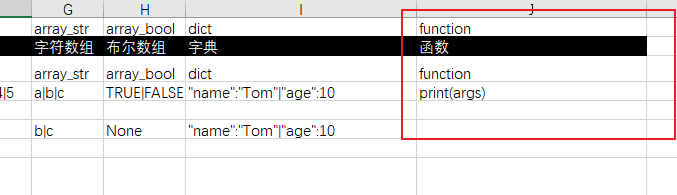
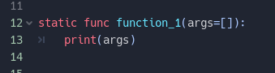
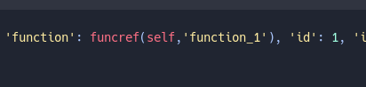
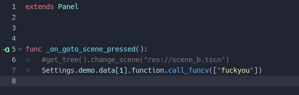

# GDExcelExporter

这个excel表导出工具是为godot项目而开发，当然设计的比较灵活可以定制导出过程用于加工生成任何你想要的数据格式文件。

不过默认的导出器将excel表的数据直接导出成gd脚本功能已经十分完善，支持各种类型字段，更利害的是支持在excel表里配置gdscript函数，这意味着
你可以把部分简单的逻辑剥离到数据表里去。

`v1.1.0`版本做了代码上的整理，删除了sample目录里自定义导出器的示例代码，因为我觉得默认导出gdscript数据无论从效率还是功能上都远超其他导出器，所以去掉了。
以后再把自定义导出器的示例代码补上。

内置默认的生成器是gdscript的，还没有做C#的生成器，你可以自己自定义生成器自己实现一个，或者等我以后有空我实现一个。

注意:1.1版本跟1.0版本导出的表不兼容！如果你的项目已经很大，并且用了1.0版本很久，那么不建议你升级。

## 如何参与维护

这个小工具其实不值得一起维护，你直接拿去用或者抄去自己改一版就完事了。
不过如果你有这个热情，我也不会拒绝。

详情看下面文档

[CONTRIBUTE 文档](CONTRIBUTE.md)

## 环境要求

pyhton版本：`>=python 3.8.1`

Godot版本：`>=3.4`

操作系统： windows （依赖的xlwings包只支持windows）

## 快速入门

### pip上安装

```
pip install gd-excelexporter
```

或者直接git clone 这个项目、下载这个项目，在项目目录下执行

```
pip install .
```

在控制台里输入`ee`命令即可看到命令

```shell
sage: ee [OPTIONS] COMMAND [ARGS]...

  ==========Excel表导出工具 ============

Options:
  --help  Show this message and exit.

Commands:
  create-completed-hook  创建导表完成钩子脚本
  create-generator       创建生成器脚本
  gen-all                导出所有表
  gen-one                打开并导出整张excel表
  init                   生成默认配置表项目
```

### 直接用release的ee.exe

到release页直接下载最新版本exe

https://github.com/kaluluosi/GDExcelExporter/releases

想要在控制台里能直接调用ee命令，你需要把ee.exe加入到系统环境变量里。

### 配套的Godot插件

https://github.com/kaluluosi/GDEexcelExporer-Plugin

## 快速开始
Godot项目使用很简单

直接到你的游戏项目里创建一个`settings`目录，然后进入该目录执行以下命令。


```shell
ee init
```

然后就会生成下面文件


把你的Excel表放到data目录。
注意！Excel表有格式要求，该目录下默认有个template.xlsx是范本，你可以直接复制这个范本。

然后在这个目录下调用：

```shell
ee gen-all
```


dist目录下就会生成以下文件


*demo.gd*
```python
# 本文件由代码生成，不要手动修改

extends Reference
class Function extends Reference:

    var func_name
    var script_path

    func _init(script_path, func_name):
        self.func_name = func_name
        self.script_path = script_path

    func call(args=[]):
        var this_script = load(script_path)
        return this_script.call(self.func_name, args)

var None = null
var False = false
var True = true

var data = \
{1: {'array': [1, 2, 3, 4, 5], 'array_bool': [True, False], 'array_str': ['a', 'b', 'c'], 'bool': True, 'dict': {'age': 10, 'name': 'Tom'}, 'float ': 1.0, 'function': Function.new(self.get_script().get_path(),'function_1'), 'id': 1, 'int': 1, 'string': '恭喜你！成功配置好了Godot导表项目。'}, 2: {'array': [], 'array_bool': [], 'array_str': [], 'bool': True, 'dict': {}, 'float ': 0, 'function': Function.new(self.get_script().get_path(),'function_2'), 'id': 2, 'int': 0, 'string': 'aa'}, 3: {'array': [1, 2, 3], 'array_bool': [True], 'array_str': ['b', 'c'], 'bool': True, 'dict': {'age': 10, 'name': 'Tom'}, 'float ': 2.0, 'function': Function.new(self.get_script().get_path(),'function_3'), 'id': 3, 'int': 2, 'string': ''}, 4: {'array': [], 'array_bool': [], 'array_str': [], 'bool': True, 'dict': {}, 'float ': 3.01, 'function': Function.new(self.get_script().get_path(),'function_4'), 'id': 4, 'int': 3, 'string': ''}, 5: {'array': [], 'array_bool': [], 'array_str': [], 'bool': True, 'dict': {}, 'float ': 0, 'function': Function.new(self.get_script().get_path(),'function_5'), 'id': 5, 'int': 4, 'string': '你真可悲，你什么都不是，你毫无作为，你无足轻重，你一无是处。\n我，整个城市都是我的。\n等警察抓住你们的时候......你会死的毫无意义。这里是我的地盘。\n你...你....你就是人们要躲避的东西。'}, 6: {'array': [], 'array_bool': [], 'array_str': [], 'bool': True, 'dict': {}, 'float ': 0, 'function': Function.new(self.get_script().get_path(),'function_6'), 'id': 6, 'int': 0, 'string': ''}}


static func function_1(args=[]):
    print(args)


static func function_2(args=[]):
    pass


static func function_3(args=[]):
    pass


static func function_4(args=[]):
    pass


static func function_5(args=[]):
    pass


static func function_6(args=[]):
    pass
```

*settings.gd*
```python
# 本文件由代码生成，不要手动修改
extends Node
# 这个脚本你需要挂到游戏的Autoload才能全局读表

var demo = load('res://test/dist/示例/demo.gd').new()

```

然后把settings.gd挂到Autoload里面去。


这样你就可以快乐的在GDScript代码里这样读表了：
```python
func _ready():
	var data = Settings.demo.data
	print(data[1].string)
	data[1].function.call(['还可以调用excel里配置的函数！'])

```


## exporter.toml讲解
```toml
[settings]
ignore_sheet_mark = "*"  # 如果sheet以这个符号开头，那么就跳过不导出
custom_generator = "" # 自定义生成脚本（用python写）
completed_hook = "" # 自定义导出结束钩子脚本 （用python写）
input = "data" # 你Excel表所在目录的相对路径
output = "dist" # 你要输出保存的相对路径
project_root = ".." # 项目文件夹相对于当前Settings目录的路径
```

**ignore_sheet_mark**

如果sheet以这个符号开头，那么就跳过不导出

**custom_generator**

自定义生成脚本路径（用python写），是用来覆盖默认生成逻辑的。
GDExcelExporter默认生成的是GDScript数据文件，如果你有自己的数据文件方案，比如生成json、Resource、乃至C#，又或者其他，你得自己实现。
用`ee create-generator`命令会给你生成一个模板python脚本，你可以在这个模板上实现你自己的导出器。
然后把脚本相对路径配置到`custom_generator`即可。

**completed_hook** 

自定义导出结束钩子脚本路径（用python写），用来覆盖导完表后的处理。
GDExcelExporter默认会在这里处理生成一个settings.gd文件，用来快速读表。
你有自己的需要可以自己实现一个脚本然后路径设置上去覆盖。
用`ee create-completed-hook`命令会给你生成一个模板python脚本，你可以在这个模板上实现你自己的完成动作。
然后把脚本相对路径配置到`completed_hook`即可。

**input** 

你Excel表所在目录的相对路径

**output** 

你要输出保存的相对路径

**project_root**

这个比较难理解，简单的说就是你的`Godot游戏项目`对于`Settings目录`的相对路径。
比如你的`Settings目录`是在`Godot游戏项目目录`下，那么相对路径就是"../"，`Settings目录`的上一级就是`Godot游戏项目目录`。这样`settings.gd`生成代码里load数据文件的资源url才能正确生成，不然你可能得到的是 “res://dist/道具/Item.gd”，这就不正确了。

举个例子，你可能想要这样的效果：`Settings目录`跟`Godot游戏项目`平级，然后把数据文件导出到`Godot游戏项目`。你的目录结构是这样的：

```
--+
  |--- Godot游戏项目
  |           |
  |           +----Data
  |----Settings
```
你想从`Settings目录`把数据文件导入到`Godot游戏项目/Data`目录里

那么你的export.toml要这样配置

```toml
[settings]
ignore_sheet_mark = "*"  
custom_generator = "" 
completed_hook = "" 
input = "data" # 
output = "../Godot游戏项目/Data" 
project_root = "../Godot游戏项目" # 项目文件夹相对于当前Settings目录的路径
```

这样子 GDExcelExporter 就能够知道 `../Godot游戏项目` 才是项目根目录，从而生成“res://”路径的时候才能正确截取相对于项目目录的路径塞进去。

>如果你的settings目录是在godot项目目录里其实你不需要去修改input、output、project_root，默认的就很好了，除非你数据表和游戏项目要分离存放默认的策略无法支持你才去修改配置。

## Excel表格式


### Sheet名字规则**


中文名[-生成文件名]

生成文件名是可选的，如果你希望生成的数据文件是别的名字（主要是生成英文文件名），那么你加上，不然Exporter默认传递给custom_generator的output是用中文名。


### sheet格式**

**注意！Excel表格式有固定要求！**


|int|float|string|
|---|---|---|
|编号|名称|售价|
|id|name|price|
|数值|数值|数值|

上面是示例

GDExcelExporter会固定读取头三行数据，第四行开始才算是表具体数据，头三行只是定义描述，GDExcelExporter本身不会去根据这些类型作什么处理，会被存到data字典传递给custom_generator脚本供具体使用。

1. 第一行是用来定义字段类型
2. 第二行是字段中文描述
3. 第三行是字段英文名（用于生成字典的key）

除了头三行必须要有数据外，什么颜色，格式之类的没有要求，你可以随意标注颜色加批注不影响。

### 字段类型

数组、bool数组、字符数组、字典、函数 支持


#### array
采用`|`作为分隔符，因为再excel中用`,`做分割符会被自动当作千位符帮你转换改数值，要调回去太麻烦。
array 这个类型标注你可以理解为就是python里直接eval这个字符串。
1|2|3 => [1,2,3]
"a"|"你"|"我" => ["a","你","我"]`
不过建议默认把array当作数字类型数组来使用，因为字符串数组另外有array_str类型标注

#### array_str 字符串数组
因为在excel里写字符串数组的字符都要敲双引号太麻烦，所以设置了这个类型标注。
你可以不加双引号的写字符串数组：
a|你|我 => ["a","你","我”]

#### array_bool 布尔数组
直接套用Excel里的bool字符： 
FALSE|TRUE|TRUE => [False,True,True]

#### dict  字典
你直接按照python的语法写字典，把`,`换`|`，同时不要写左右两边花括号即可。
"name":"Tom"|"age":10  =>  {"name":"Tom","age":10}

#### function 函数
这是最牛逼的……要在excel里把函数导出到gd脚本，这个方案想了很久，最后成功实现。以后可以把部分逻辑剥离到数据表里配置了。
导出的函数只有一个 args数组参数，这个参数默认值是`[]`。也就是说args数组哪一位是什么意思调用这个函数的人得自己心知肚明。
数据表的函数可以访问`autoload`的全局对象，和args传进来的参数对象。






